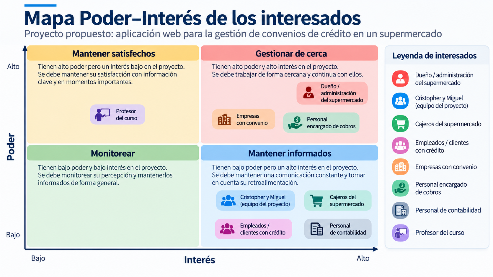

# Programa de Gestión de Deudas

> Proyecto · Definición e interesados

**Universidad Técnica Nacional**  
Sede San Carlos

| Información | Detalle |
| --- | --- |
| Curso | Administración de Proyectos Informáticos |
| Código | ISW-912 |
| Proyecto | Programa de Gestión de Deudas |
| Profesor | Deiver Cubero Molina |

**Integrantes**

- Cristopher Quiros Araya
- Isifredo Miguel Cruz Vargas

---

## Contenido

- [Semana 1 · Definición del proyecto](#semana-1--definición-del-proyecto)
  - [Problema](#problema)
  - [Proyecto propuesto](#proyecto-propuesto)
  - [Valor esperado](#valor-esperado)
  - [Objetivo general](#objetivo-general)
  - [Objetivos específicos](#objetivos-específicos)
- [Semana 2 · Taller: interesados de nuestro proyecto](#semana-2--taller-interesados-de-nuestro-proyecto)
  - [Contexto y restricciones del proyecto](#contexto-y-restricciones-del-proyecto)
  - [Registro de interesados](#registro-de-interesados)
  - [Justificación de poder e interés](#justificación-de-poder-e-interés)
  - [Mapa Poder–Interés](#mapa-poderinterés)
  - [Tres interesados críticos y estrategia de involucramiento](#tres-interesados-críticos-y-estrategia-de-involucramiento)
  - [Preguntas de análisis](#preguntas-de-análisis)
  - [Enfoque de gestión del proyecto](#enfoque-de-gestión-del-proyecto)
- [Sprint 2 · Semanas 3 y 4: planeamiento del proyecto](#sprint-2--semanas-3-y-4-planeamiento-del-proyecto)
  - [Propósito del Sprint](#propósito-del-sprint)
  - [Alcance del sistema](#alcance-del-sistema)
  - [Necesidades de los usuarios](#necesidades-de-los-usuarios)
  - [Flujos principales](#flujos-principales)
  - [Definición funcional de la solución](#definición-funcional-de-la-solución)
  - [Reglas de negocio](#reglas-de-negocio)
  - [Criterios de comprobación](#criterios-de-comprobación)
  - [Ciclo de vida del proyecto](#ciclo-de-vida-del-proyecto)
  - [Roles y responsabilidades](#roles-y-responsabilidades)
  - [Organización de las semanas 3 y 4](#organización-de-las-semanas-3-y-4)
  - [Backlog técnico de referencia](#backlog-técnico-de-referencia)

---

## Semana 1 · Definición del proyecto

### Problema

El supermercado mantiene convenios con diferentes empresas para que sus empleados puedan realizar compras utilizando un monto de crédito autorizado. Actualmente, el control de compras, pagos y saldos se realiza mediante documentos físicos o registros dispersos.

Esto puede provocar errores en los saldos, pérdida de información, dificultad para conocer cuánto crédito tiene disponible cada cliente y problemas al momento de realizar los cobros correspondientes a cada empresa.

### Proyecto propuesto

Desarrollar una aplicación web que permita administrar los convenios de crédito entre el supermercado y las empresas, llevando un control centralizado de los clientes, sus cuentas y los movimientos realizados.

El sistema permitirá registrar cargos por compras y abonos por pagos, actualizar automáticamente el saldo disponible de cada cliente y mantener un historial de las transacciones realizadas.

### Valor esperado

Mejorar el control de los convenios de crédito, reducir errores en el manejo de saldos y facilitar el seguimiento de las compras y pagos realizados por los empleados de cada empresa.

Además, permitirá agilizar la atención, facilitar los procesos de cobro y mantener información organizada y confiable para el supermercado.

### Objetivo general

Desarrollar una aplicación web que permita la administración de manera centralizada, segura y eficiente de los convenios entre el supermercado y diferentes empresas, controlando las cuentas, compras, pagos y saldos de sus empleados para reducir errores y pérdidas económicas y mejorar la trazabilidad de las operaciones.

### Objetivos específicos

- Registrar las empresas y los clientes asociados a cada convenio.
- Gestionar las cuentas de los clientes y mantener actualizado su saldo disponible.
- Registrar cargos y abonos, evitando que los clientes realicen compras superiores al saldo autorizado.
- Mantener un historial de movimientos que facilite la consulta, el control y la generación de reportes sobre las operaciones realizadas.

---

## Semana 2 · Taller: interesados de nuestro proyecto

### Contexto y restricciones del proyecto

El proyecto se desarrolla para un supermercado que mantiene convenios de crédito con diferentes empresas. Actualmente, parte del control de compras, pagos y saldos se realiza mediante documentos físicos o registros dispersos, por lo que será necesario organizar esta información para incorporarla al sistema.

El proyecto será desarrollado dentro del periodo establecido para el curso, por lo que el tiempo disponible representa una de las principales restricciones y será necesario priorizar las funcionalidades más importantes.

Además, al tratarse de una aplicación web, se deberá considerar la infraestructura tecnológica necesaria, la protección de los datos de los clientes y la información proporcionada por el supermercado sobre el funcionamiento de los convenios.

### Registro de interesados

| Interesado | Necesidad | Poder | Interés | Actitud | Estrategia | Responsable |
| --- | --- | :---: | :---: | --- | --- | --- |
| Dueño / administrador del supermercado | Tener control de todo y ver cómo va el negocio. | 5 | 5 | Favorable | Gestionar de cerca y validar decisiones importantes. | Ambos |
| Cristopher y Miguel – equipo del proyecto | Tener requisitos claros e información para desarrollar el sistema. | 4 | 5 | Favorable | Coordinar tareas y revisar avances constantemente. | Ambos |
| Cajeros del supermercado | Registrar las compras a crédito de forma rápida y correcta. | 3 | 5 | Favorable | Mantener informados y consultar cómo realizan el proceso. | Cristopher |
| Empleados que utilizan el crédito | Conocer su saldo disponible y tener sus compras y pagos correctamente registrados. | 2 | 5 | Favorable | Mantener informados y tomar en cuenta su experiencia de uso. | Miguel |
| Empresas con convenio | Llevar control de los créditos utilizados por sus empleados. | 4 | 4 | Favorable | Consultar necesidades y mantener comunicación durante las validaciones. | Ambos |
| Personal encargado de cobros del supermercado | Consultar saldos, pagos y montos pendientes de cada convenio. | 4 | 5 | Favorable | Involucrar en la definición y validación del proceso de cobro. | Cristopher |
| Personal de contabilidad del supermercado | Contar con información correcta y trazable sobre cargos y pagos. | 3 | 4 | Neutral | Consultar necesidades relacionadas con movimientos y reportes. | Miguel |
| Profesor del curso | Que el proyecto cumpla con los objetivos y entregables establecidos en el curso. | 4 | 3 | Neutral | Mantener informado mediante las entregas y aplicar la retroalimentación. | Ambos |

### Justificación de poder e interés

- **Dueño / administrador del supermercado — Poder 5 / Interés 5:** tiene la mayor capacidad para aprobar decisiones y definir las necesidades del negocio. Además, el sistema busca mejorar directamente el control de los convenios del supermercado.
- **Cristopher y Miguel, equipo del proyecto — Poder 4 / Interés 5:** toman las decisiones relacionadas con el desarrollo y organización del proyecto, aunque las necesidades del negocio deben validarse con el supermercado.
- **Cajeros del supermercado — Poder 3 / Interés 5:** tienen influencia limitada sobre las decisiones del proyecto, pero el sistema afecta directamente el proceso que utilizan para registrar las compras a crédito.
- **Empleados que utilizan el crédito — Poder 2 / Interés 5:** no tienen autoridad para tomar decisiones sobre el proyecto, pero tienen un interés alto porque sus compras, pagos y saldos serán gestionados mediante el sistema.
- **Empresas con convenio — Poder 4 / Interés 4:** pueden influir en las condiciones relacionadas con los convenios y necesitan que la información de los créditos utilizados por sus empleados sea correcta.
- **Personal encargado de cobros — Poder 4 / Interés 5:** conoce y utiliza la información relacionada con saldos, pagos y montos pendientes, por lo que puede influir en la definición y validación de estas funcionalidades.
- **Personal de contabilidad — Poder 3 / Interés 4:** necesita información correcta sobre cargos y pagos para realizar controles, aunque no toma las principales decisiones del proyecto.
- **Profesor del curso — Poder 4 / Interés 3:** puede establecer requisitos y solicitar cambios relacionados con el proyecto académico, aunque no participa directamente en la operación del sistema.

### Mapa Poder–Interés

Los valores de **1 a 3** se consideran nivel bajo y los valores de **4 a 5** nivel alto.

### Tres interesados críticos y estrategia de involucramiento

| Interesado crítico | Cómo se involucrará | Momento o frecuencia propuesta | Responsable |
| --- | --- | --- | --- |
| Dueño / administrador del supermercado | Mediante consultas y revisiones de los avances para validar que el sistema se ajuste al funcionamiento del supermercado. | Al inicio y al finalizar cada etapa del proyecto. | Ambos |
| Empresas con convenio | Mediante consultas para conocer sus necesidades y validar la información relacionada con los créditos de sus empleados. | Durante la definición de requisitos y cuando existan funciones relacionadas con los convenios para revisar. | Miguel |
| Cajeros del supermercado | Mediante consultas y pruebas para comprobar que el registro de compras a crédito sea sencillo y se adapte al proceso que realizan diariamente. | Durante la definición del proceso de compra y cuando exista una versión que puedan probar. | Cristopher |

### Preguntas de análisis

#### ¿A quién debemos involucrar primero?

Al dueño o administrador del supermercado, ya que conoce el funcionamiento del negocio y puede definir las necesidades principales que debe cubrir el sistema, además de que es quien lo necesita.

#### ¿Quién puede bloquear una decisión?

El dueño o administrador del supermercado, debido a que tiene la autoridad para aprobar o rechazar decisiones relacionadas con el funcionamiento del sistema. Las empresas con convenio también pueden influir cuando una decisión afecte las condiciones acordadas con ellas.

#### ¿Quién necesita información frecuente?

El dueño del supermercado y el equipo del proyecto, ya que participan directamente en la definición, desarrollo y validación del sistema. Los cajeros también deben mantenerse informados cuando se realicen cambios relacionados con el registro de compras a crédito.

#### ¿Qué interesado estamos subestimando?

Los cajeros, porque, aunque no tienen un poder alto sobre las decisiones del proyecto, utilizan directamente el proceso de compras a crédito y pueden detectar problemas que no sean evidentes durante el desarrollo.

#### ¿Qué conflicto de expectativas puede aparecer?

Puede existir un conflicto entre el control que necesita el supermercado y la facilidad y rapidez que esperan los cajeros y clientes al utilizar el sistema. También podrían existir diferencias entre las necesidades del supermercado y las condiciones establecidas por las empresas con convenio.

### Enfoque de gestión del proyecto

Para este proyecto se propone un **enfoque híbrido**, ya que las funcionalidades principales están definidas desde el inicio, como el registro de empresas y clientes, el control de cuentas, los cargos y abonos y la consulta de saldos.

Sin embargo, algunos detalles del sistema pueden cambiar durante el desarrollo a partir de las pruebas y la retroalimentación del dueño del supermercado, los cajeros, los clientes y las empresas con convenio.

Por esta razón, se mantendrá una planificación general del proyecto, pero las funcionalidades se desarrollarán y validarán por partes, permitiendo realizar ajustes cuando sea necesario.

---

## Sprint 2 · Semanas 3 y 4: planeamiento del proyecto

### Propósito del Sprint

Durante las semanas 3 y 4 se realizará el planeamiento detallado del proyecto. En esta etapa se busca pasar de la idea general planteada durante las primeras semanas a una descripción más clara de lo que se espera del sistema, las personas que lo utilizarán y las condiciones que deberá respetar.

Este Sprint no contempla todavía la programación de la aplicación. Su propósito es ordenar la información disponible y establecer una base común que permita tomar mejores decisiones en las etapas siguientes. Para ello se definirá el alcance, se identificarán las necesidades de los usuarios, se describirán los procesos principales y se organizará el trabajo de manera general.

### Alcance del sistema

El proyecto contempla una aplicación web para administrar los convenios de crédito que el supermercado mantiene con distintas empresas. La solución permitirá centralizar la información de las empresas, sus empleados, las cuentas de crédito y los movimientos realizados.

Dentro del alcance se considera:

- Registrar y actualizar empresas con convenio.
- Registrar clientes y asociarlos con la empresa en la que trabajan.
- Crear y administrar las cuentas de crédito de los clientes.
- Definir el límite de crédito autorizado para cada cuenta.
- Consultar el saldo utilizado y el saldo disponible.
- Registrar las compras realizadas a crédito.
- Registrar pagos o abonos.
- Consultar el historial de movimientos.
- Consultar las deudas pendientes por cliente y por empresa.
- Generar reportes básicos para apoyar los procesos de control y cobro.
- Administrar el acceso de los usuarios según sus responsabilidades.

Para mantener el proyecto dentro del tiempo disponible, no se incluyen inicialmente la facturación electrónica, el control general del inventario, la contabilidad completa del supermercado, el procesamiento de pagos bancarios, una aplicación móvil ni la integración automática con sistemas externos. Estas posibilidades podrían valorarse en el futuro, pero no forman parte del alcance actual.

### Necesidades de los usuarios

Las necesidades se organizaron tomando en cuenta a las personas que participan directamente en el manejo de los convenios. Estas necesidades expresan lo que cada usuario espera resolver; todavía no representan tareas de programación.

| Código | Usuario o interesado | Necesidad identificada |
| --- | --- | --- |
| N01 | Administrador | Ingresar al sistema de manera segura. |
| N02 | Administrador | Registrar y mantener actualizada la información de las empresas con convenio. |
| N03 | Administrador | Registrar clientes y relacionarlos con la empresa correspondiente. |
| N04 | Administrador | Crear cuentas de crédito y definir su límite autorizado. |
| N05 | Administrador | Activar, suspender o cerrar una cuenta cuando sea necesario. |
| N06 | Cajero | Localizar rápidamente al cliente que desea realizar una compra a crédito. |
| N07 | Cajero | Consultar si la cuenta está activa y cuánto crédito tiene disponible. |
| N08 | Cajero | Registrar una compra sin permitir que se exceda el crédito autorizado. |
| N09 | Encargado de cobros | Registrar correctamente los pagos o abonos recibidos. |
| N10 | Encargado de cobros | Consultar los montos pendientes de cada cliente y empresa. |
| N11 | Empresa con convenio | Contar con información clara sobre las cuentas de sus empleados. |
| N12 | Contabilidad | Consultar información ordenada y trazable sobre cargos y pagos. |
| N13 | Administrador | Corregir movimientos mediante un proceso controlado que conserve la trazabilidad. |
| N14 | Administrador | Obtener reportes por cliente, empresa y periodo. |
| N15 | Todos los usuarios autorizados | Consultar información actualizada y confiable de acuerdo con sus permisos. |

### Flujos principales

#### Registro de una empresa con convenio

El administrador ingresa al apartado de empresas y comprueba que la empresa no se encuentre registrada. Luego incorpora sus datos y las condiciones generales del convenio. Una vez validada la información, la empresa queda disponible para asociar clientes y cuentas de crédito.

#### Registro de un cliente y creación de su cuenta

Antes de registrar al cliente, se verifica si ya existe. Si es un cliente nuevo, se ingresan sus datos y se relaciona con la empresa para la que trabaja. Posteriormente se crea su cuenta, se establece el límite autorizado y se define su estado inicial.

#### Compra de un cliente con cuenta

El cajero identifica al cliente y consulta su cuenta. El sistema debe mostrar si se encuentra activa y cuál es el saldo disponible. Después de ingresar el monto de la compra, se comprueba que exista crédito suficiente. Si la operación es válida, se registra el cargo y se actualizan los saldos.

#### Atención de una persona sin cuenta activa

Si la persona no está registrada, no posee una cuenta o su cuenta se encuentra suspendida, la compra no podrá procesarse como crédito. El cajero deberá informarle la situación y la persona tendrá que utilizar otro medio de pago o solicitar la revisión de su cuenta al personal autorizado.

#### Registro de un pago o abono

El encargado de cobros localiza la cuenta y consulta su deuda. Luego registra el monto y la información del pago. Después de validar los datos, el sistema incorpora el abono al historial y actualiza tanto la deuda pendiente como el crédito disponible.

#### Consulta del historial y de los reportes

El usuario autorizado selecciona un cliente o una empresa y, cuando sea necesario, establece un periodo. La consulta presenta los cargos, abonos y ajustes relacionados. Esta información sirve para revisar una cuenta, dar seguimiento a los cobros y preparar reportes.

### Definición funcional de la solución

La solución se organizó en las siguientes páginas principales. En este Sprint solamente se describe la función de cada una; su inclusión no significa que deban programarse todavía.

| N.º | Página | Finalidad |
| ---: | --- | --- |
| 1 | Inicio de sesión | Permitir el ingreso de los usuarios autorizados. |
| 2 | Panel principal | Presentar un resumen de cuentas, saldos y actividades importantes. |
| 3 | Empresas | Consultar y buscar las empresas que mantienen un convenio. |
| 4 | Registro de empresa | Crear o actualizar la información de una empresa. |
| 5 | Detalle de empresa | Consultar sus clientes, cuentas y deuda acumulada. |
| 6 | Clientes | Buscar y consultar a las personas registradas. |
| 7 | Registro de cliente | Crear o actualizar la información de un cliente. |
| 8 | Detalle de cliente | Mostrar la empresa, cuenta, saldos e historial del cliente. |
| 9 | Cuentas de crédito | Consultar cuentas activas, suspendidas o cerradas. |
| 10 | Configuración de cuenta | Crear una cuenta y administrar su límite y estado. |
| 11 | Registro de compra | Comprobar el crédito disponible y registrar un cargo. |
| 12 | Registro de pago | Incorporar un pago o abono a la cuenta. |
| 13 | Historial de movimientos | Consultar cargos, abonos, anulaciones y ajustes. |
| 14 | Gestión de cobros | Dar seguimiento a los saldos pendientes. |
| 15 | Reportes | Consultar información por cliente, empresa y periodo. |
| 16 | Usuarios y permisos | Administrar el acceso y las responsabilidades de los usuarios. |

### Reglas de negocio

- **RB01.** Todo cliente con crédito debe estar asociado con una empresa que tenga un convenio activo.
- **RB02.** Un cliente no puede tener dos cuentas activas asociadas con el mismo convenio.
- **RB03.** El límite de crédito debe ser mayor que cero y solamente puede ser modificado por personal autorizado.
- **RB04.** Una compra no puede superar el saldo disponible de la cuenta.
- **RB05.** No se pueden registrar compras en cuentas suspendidas o cerradas.
- **RB06.** Cada cargo aumenta la deuda y reduce el saldo disponible.
- **RB07.** Cada abono válido reduce la deuda y recupera saldo disponible.
- **RB08.** Un abono no puede ser mayor que la deuda pendiente, a menos que el supermercado decida manejar saldos a favor.
- **RB09.** Todo movimiento debe registrar su fecha, tipo, monto, cuenta y usuario responsable.
- **RB10.** Un movimiento confirmado no debe eliminarse directamente. Cualquier corrección se realizará mediante una anulación o un ajuste que quede registrado.
- **RB11.** Una empresa con cuentas pendientes no podrá eliminarse del sistema; solamente podrá cambiarse su estado cuando corresponda.
- **RB12.** La información histórica debe conservarse aunque una empresa, un cliente o una cuenta dejen de estar activos.
- **RB13.** Los montos deben ser positivos y utilizar el formato monetario establecido.
- **RB14.** Cada usuario solamente podrá realizar las acciones permitidas por su rol.
- **RB15.** Los reportes y saldos deben considerar únicamente movimientos válidos y confirmados.

### Criterios de comprobación

Los criterios de comprobación permiten determinar, desde la etapa de planeamiento, qué resultado se esperaría de cada función.

| Función planteada | Forma de comprobarla |
| --- | --- |
| Registrar una empresa | La empresa queda registrada cuando se completan los datos obligatorios y no existe un registro duplicado. |
| Crear una cuenta | La cuenta queda asociada con el cliente y muestra el límite autorizado, sin deuda inicial. |
| Registrar una compra | El cargo se incorpora al historial y los saldos se actualizan cuando existe crédito suficiente. |
| Validar el crédito | La operación se rechaza y no se modifica el saldo cuando el monto supera el crédito disponible. |
| Registrar un abono | El pago aparece en el historial, disminuye la deuda y recupera el saldo disponible correspondiente. |
| Consultar el historial | Se muestran los movimientos de la cuenta con fecha, tipo, monto y responsable. |
| Cambiar el estado de una cuenta | El cambio solamente puede realizarlo un usuario autorizado y queda registrado. |
| Generar un reporte | La información presentada corresponde con la empresa, el cliente y el periodo seleccionados. |

### Ciclo de vida del proyecto

El proyecto seguirá el enfoque híbrido definido durante las primeras semanas. Se mantendrá una planificación general para orientar el trabajo, pero los resultados se revisarán por partes para incorporar observaciones y realizar ajustes cuando sea necesario.

El ciclo de vida se divide en las siguientes etapas:

1. **Definición:** identificación del problema, propuesta, objetivos e interesados.
2. **Planeamiento:** definición del alcance, necesidades, procesos, reglas, responsabilidades y cronograma.
3. **Diseño y validación:** elaboración de modelos o propuestas y revisión con los interesados.
4. **Ejecución o simulación:** desarrollo de las actividades priorizadas según el alcance académico del curso.
5. **Seguimiento y control:** revisión del avance, los riesgos, los cambios y la calidad de los resultados.
6. **Cierre:** evaluación del proyecto, presentación de resultados y registro de las lecciones aprendidas.

### Roles y responsabilidades

| Participante | Responsabilidades principales |
| --- | --- |
| Dueño o administrador del supermercado | Explicar las necesidades del negocio, aclarar el funcionamiento de los convenios y validar las decisiones importantes. |
| Cristopher | Apoyar la coordinación del proyecto, documentar procesos y dar seguimiento a los aspectos relacionados con compras y cobros. |
| Miguel | Apoyar la planificación funcional, organizar la información del sistema y dar seguimiento a las cuentas, movimientos y reportes. |
| Cristopher y Miguel | Preparar los entregables, distribuir las actividades, revisar los avances y aplicar las observaciones recibidas. |
| Profesor | Revisar los entregables, orientar el trabajo académico y brindar retroalimentación. |

La distribución interna podrá ajustarse de común acuerdo cuando la cantidad o dificultad de las actividades lo requiera. Aunque exista una división inicial, ambos integrantes son responsables de revisar y comprender el resultado completo.

### Organización de las semanas 3 y 4

| Semana | Actividades previstas | Resultado esperado |
| --- | --- | --- |
| Semana 3 | Revisar los objetivos, delimitar el alcance, identificar las necesidades, describir los flujos y organizar las páginas principales. | Definición clara de lo que debe resolver el sistema y de cómo se espera que funcione. |
| Semana 4 | Establecer las reglas de negocio, los criterios de comprobación, el ciclo de vida, las responsabilidades, el cronograma y el backlog de referencia. | Planeamiento integrado y revisado para orientar las siguientes etapas del proyecto. |

Al finalizar ambas semanas se realizará una revisión conjunta para comprobar que las secciones sean coherentes entre sí y que respondan al problema definido desde el inicio.

### Backlog técnico de referencia

El backlog técnico representa el trabajo que podría requerir la construcción del sistema. En esta etapa se utiliza únicamente para comprender el tamaño de la solución, organizar prioridades y facilitar estimaciones futuras. Por lo tanto, no implica que todas las tareas deban programarse como parte del curso.

| Código | Área de trabajo | Ejemplos de actividades futuras |
| --- | --- | --- |
| BT01 | Planeamiento | Revisar el alcance, ordenar necesidades y validar los procesos. |
| BT02 | Acceso y usuarios | Definir el inicio de sesión, los roles y los permisos. |
| BT03 | Empresas y convenios | Preparar el registro, la consulta y los estados de las empresas. |
| BT04 | Clientes | Preparar el registro, la búsqueda y la asociación con empresas. |
| BT05 | Cuentas de crédito | Definir límites, estados y cálculo de saldos. |
| BT06 | Compras y cargos | Definir el registro de compras y la validación del crédito disponible. |
| BT07 | Pagos y abonos | Definir el registro de pagos y la actualización de saldos. |
| BT08 | Historial y control | Organizar movimientos, anulaciones, ajustes y trazabilidad. |
| BT09 | Cobros y reportes | Definir consultas de deuda e informes por cliente, empresa y periodo. |
| BT10 | Validaciones y seguridad | Identificar datos obligatorios, restricciones y controles de acceso. |
| BT11 | Comprobación | Preparar escenarios para revisar que las funciones respondan a lo esperado. |
| BT12 | Documentación | Mantener actualizadas las decisiones, los cambios y los entregables. |

La prioridad inicial se encuentra en las empresas, los clientes, las cuentas, las compras, los abonos y la consulta de saldos, debido a que estas áreas representan el proceso central del proyecto. Los reportes avanzados y las posibles integraciones quedarían sujetos al tiempo disponible y a las decisiones que se tomen en etapas posteriores.
